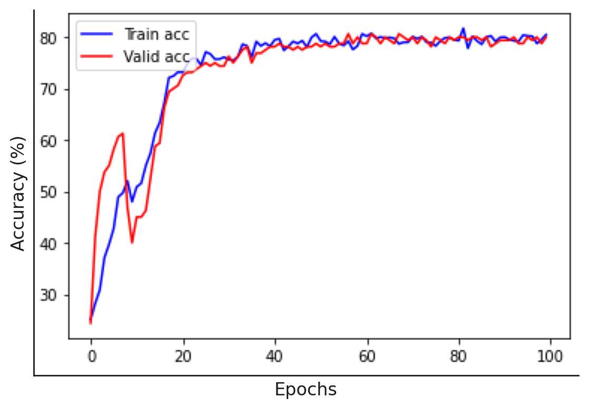
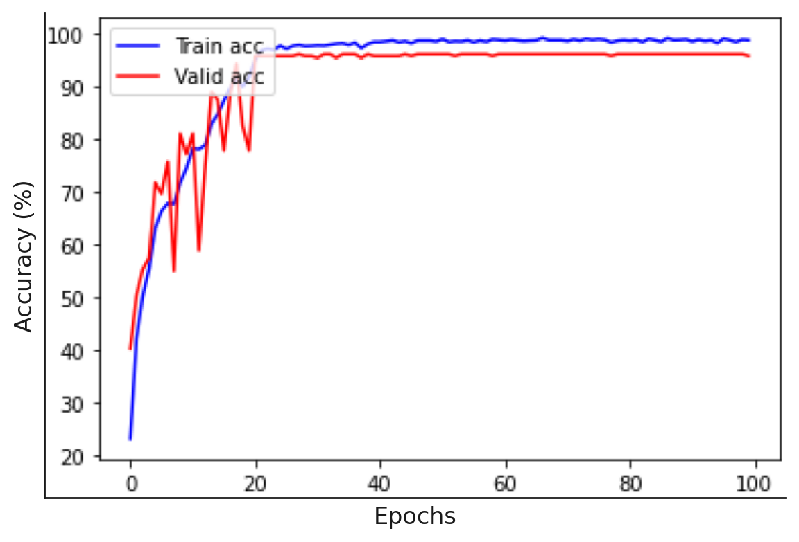

<a name="readme-top"></a>

<!-- PROJECT LOGO -->
<br />

<div align="center">
  <a href="https://github.com/alaaNfissi/CNN-n-GRU-for-speech-emotion-recognition">
    
  </a>

  <h3 align="center">Exploiting CNNs and GRUs for efficient end-to-end speech emotion recognition approach from raw waveform signal</h3>

  <p align="center">
    This paper has been submitted for publication in IEEE Transactions on Emerging Topics in Computational Intelligence.
    <br />
   </p>
   <!-- <a href="https://github.com/alaaNfissi/CNN-n-GRU-for-speech-emotion-recognition"><strong>Explore the docs »</strong></a> -->
</div>
   

  
<div align="center">

[](https://github.com/alaaNfissi/CNN-n-GRU-for-speech-emotion-recognition/#readme "Go to project documentation")

</div>  


<div align="center">
    <p align="center">
    ·
    <a href="https://github.com/alaaNfissi/CNN-n-GRU-for-speech-emotion-recognition/issues">Report Bug</a>
    ·
    <a href="https://github.com/alaaNfissi/CNN-n-GRU-for-speech-emotion-recognition/issues">Request Feature</a>
  </p>
</div>


<!-- TABLE OF CONTENTS -->
<details>
  <summary>Table of Contents</summary>
  <ol>
    <li><a href="#abstract">Abstract</a></li>
    <li><a href="#built-with">Built With</a></li>
    <li>
      <a href="#getting-started">Getting Started</a>
      <ul>
        <li><a href="#getting-the-code">Getting the code</a></li>
        <li><a href="#dependencies">Dependencies</a></li>
        <li><a href="#reproducing-the-results">Reproducing the results</a></li>
      </ul>
    </li>
    <li>
      <a href="#results">Results</a>
      <ul>
        <li><a href="#on-iemocap-dataset">On IEMOCAP dataset</a></li>
        <li><a href="#on-tess-dataset">On TESS dataset</a></li>
      </ul>
    </li>
    <li><a href="#contributing">Contributing</a></li>
    <li><a href="#license">License</a></li>
    <li><a href="#contact">Contact</a></li>
  </ol>
</details>

<div align="center">
  
![ser-approaches][ser-approaches]
  
*SER appraoches*
  
</div> 

<!-- ABSTRACT -->
## Abstract

<p align="justify"> Speech emotion recognition is challenging as human emotion is very ambiguous, making it challenging to distinguish. Often, it can only be detected intermittently across a long sentence, besides speech data with emotional categorization is typically rare.
In this paper, we introduce CNN-n-GRU, a novel end-to-end (E2E) architecture for speech emotion recognition. The proposed architecture consists of an n-layer convolutional neural network (CNN) followed by an n-layer Gated Recurrent Unit (GRU). Both CNNs and RNNs demonstrated promesing results when processing raw waveform speech input. This motivated our idea of integrating them into a single architecture in order to take advantage of both models. On the one hand, we train our model in a way where CNN component is able to recognise low-level speech representations from raw waveform instead of hand-crafted features or spectrograms, allowing the network to better capture relevant narrow-band emotion features. In this manner, the CNN can handle variable-length speech without requiring segmentation, which prevents crucial data from being lost. On the other hand, RNN component is able to learn temporal-based characteristics, allowing the network to better capture the signal’s time-distributed features. Because CNN can generate multiple levels of abstraction for feature representation, we use it as a first model component to extract high-level features, to be provided to subsequent RNN layers in order to aggregate long-term dependencies. The proposed model was evaluated for speech emotion recognition, by comparison to state-of-the-art methods on both TESS and IEMOCAP datasets. The experimental results demonstrated the high accuracy of the proposed model CNN-n-GRU, outperforming traditional classification approaches. </p>

<div align="center">
  
![model-architecture][model-architecture]
  
*Proposed model architecture*
  
</div>

<p align="right">(<a href="#readme-top">back to top</a>)</p>


### Built With
* 
* 
* 
* 
* 
* 

<p align="right">(<a href="#readme-top">back to top</a>)</p>


<!-- GETTING STARTED -->
## Getting Started
<p align="justify">

To begin our experiments, we first ensured that our signal has a sampling rate of 16 KHz and is mono-channel in order to standardise our experimental data format.
Each dataset is segmented as follows: 80\% for training, 10\% for validation, and 10\% for testing based on stratified random sampling which entails categorising the whole population into homogenous groupings known as strata. Random samples are then drawn from each stratum unlike basic random sampling which considers all members of a population as equal. With an equal possibility of being sampled, it allows us to generate a sample population that best represents the total population being studied as it is used to emphasise distinctions across groups in a population. A Grid search is then used to find the appropriate hyperparameters. Some hyperparameter optimization approaches are known as "scheduling algorithms". These Trial Schedulers have the authority to terminate troublesome trials early, halt trials, clone trials, and alter trial hyperparameters while they are still running. Thus, the Asynchronous Successive Halving algorithm (ASHA) was picked because of its high performance.

We examined four model architectures: CNN-3-GRU, CNN-5-GRU, CNN-11-GRU, and CNN-18-GRU. Each model is run for 100 epochs until it converges using Adam. As we are not using any pretrained model, the weights of each model are started from scratch. The receptive field of our first CNN layer is equal to _160_ which corresponds to _(sampling rate / 100)_ in our case to cover a 10-millisecond time span, to be comparable to the window size for many MFCC computations since we transformed all our data to 16 KHz representation. Our trials were run on a distributed multi-node system powered by four Nvidia Tesla T4 GPUs.

All source code used to generate the results and figures in the paper are in
the `CNN-n-GRU_IEMOCAP` and `CNN-n-GRU_TESS` folders.
The calculations and figure generation are all run inside
[Jupyter notebooks](http://jupyter.org/).
The data preprocessing used in this study is provided in `Data_exploration` folder.
See the `README.md` files in each directory for a full description.
  
</p>

### Getting the code

You can download a copy of all the files in this repository by cloning the
[git](https://git-scm.com/) repository:

    git clone https://github.com/alaaNfissi/CNN-n-GRU-for-speech-emotion-recognition.git

or [download a zip archive](https://github.com/alaaNfissi/CNN-n-GRU-for-speech-emotion-recognition/archive/refs/heads/main.zip).

### Dependencies

<p align="center">

You'll need a working Python environment to run the code.
The recommended way to set up your environment is through the
[Anaconda Python distribution](https://www.anaconda.com/download/) which
provides the `conda` package manager.
Anaconda can be installed in your user directory and does not interfere with
the system Python installation.
The required dependencies are specified in the file `requirements.txt`.

We use `conda` virtual environments to manage the project dependencies in
isolation.
Thus, you can install our dependencies without causing conflicts with your
setup (even with different Python versions).

Run the following command to create an `ser-env` environment to create a separate environment:
```sh 
    conda create --name ser-env
```
Activate the environment, this will enable the it for your current terminal session. Any subsequent commands will use software that is installed in the environment:
```sh 
    conda activate ser-env
 ``` 
Use Pip to install packages to Anaconda Environment:
```sh 
    conda install pip
```
Install all required dependencies in it:
```sh
    pip install -r requirements.txt
```

</p>

### Reproducing the results

<p align="center">
  
1. First, you need to download IEMOCAP and TESS datasets:
  * [IEMOCAP official website](https://sail.usc.edu/iemocap/)
  * [TESS official website](https://tspace.library.utoronto.ca/handle/1807/24487)
  
2. To be able to explore the data you need to execute the Jupyter notebook that prepares the `csv` files needed for the experiments.
To do this, you must first start the notebook server by going into the
repository top level and running:
```sh 
    jupyter notebook
```
This will start the server and open your default web browser to the Jupyter
interface. In the page, go into the `Data_exploration` folder and select the
`data_exploration.ipynb` notebook to view/run. Make sure to specify the correct datasets paths on your own machine as described in the notebook.

The notebook is divided into cells (some have text while other have code).
Each cell can be executed using `Shift + Enter`.
Executing text cells does nothing and executing code cells runs the code
and produces it's output.
To execute the whole notebook, run all cells in order.

3. After generating the needed `csv` files `IEMOCAP_dataset.csv` and `TESS_dataset.csv`, go to your terminal where the `ser-env` environment was
  activated and go to `CNN-n-GRU_IEMOCAP` folder and choose one of the python files to run the experiment that you want. For example:
```sh  
python iemocap_cnn_3_gru.py
```
  
  _You can do the same thing for the TESS dataset by going to the `CNN-n-GRU_IEMOCAP` and runing one of the python files._


</p>


<p align="right">(<a href="#readme-top">back to top</a>)</p>


## Results
<p align="center">
  
We implemented the proposed architecture CNN-n-GRU in four versions, with n = 3, 5, 11, and 18.
  
</p>

### On IEMOCAP dataset
<p align="center">
  
Amoung our model’s four versions performance, the best architecture of our model is CNN-18-GRU as it achieves the highest accuracy and F1-score, 
where it reaches 81.3% accuracy and 80.9% F1-score on the IEMOCAP dataset which is better compared to the state of-the-art methods.
The CNN-18-GRU training and validation accuracy over epochs figure shows the evolution of training and validation accuracy of the CNN-18-GRU over 100 epochs. The confusion matrix in CNN-18-GRU confusion matrix figure describes class-wise test results of the CNN18-GRU.
  
</p>

CNN-18-GRU training and validation accuracy over epochs            |  CNN-18-GRU confusion matrix
:-----------------------------------------------------------------:|:-----------------------------:
  |  


### On TESS dataset
<p align="center">
  
Amoung our model’s four versions performance, the best architecture of our model is CNN-18-GRU as it achieves the highest accuracy and F1-score, 
where it reaches  99.2% accuracy and 99% F1-score on the TESS dataset which is better compared to the state of-the-art methods.
The CNN-18-GRU training and validation accuracy over epochs figure shows the evolution of training and validation accuracy of the CNN-18-GRU over 100 epochs. The confusion matrix in CNN-18-GRU confusion matrix figure describes class-wise test results of the CNN18-GRU.
  
</p>

CNN-18-GRU training and validation accuracy over epochs            |  CNN-18-GRU confusion matrix
:-----------------------------------------------------------------:|:-----------------------------:
  |  

<p align="right">(<a href="#readme-top">back to top</a>)</p>

<p align="center">
  
_For more detailed experiments and results you can read the paper._
  
</p>


<!-- CONTRIBUTING -->
## Contributing

Contributions are what make the open source community such an amazing place to learn, inspire, and create. Any contributions you make are **greatly appreciated**.

If you have a suggestion that would make this better, please fork the repo and create a pull request. You can also simply open an issue with the tag "enhancement".
Don't forget to give the project a star! Thanks again!

1. Fork the Project
2. Create your Feature Branch (`git checkout -b feature/AmazingFeature`)
3. Commit your Changes (`git commit -m 'Add some AmazingFeature'`)
4. Push to the Branch (`git push origin feature/AmazingFeature`)
5. Open a Pull Request

<p align="right">(<a href="#readme-top">back to top</a>)</p>


<!-- LICENSE -->
## License

All source code is made available under a BSD 3-clause license. You can freely
use and modify the code, without warranty, so long as you provide attribution
to the authors. See `LICENSE.md` for the full license text.

<p align="right">(<a href="#readme-top">back to top</a>)</p>


<!-- CONTACT -->
## Contact

Alaa Nfissi - [@LinkedIn](https://www.linkedin.com/in/alaa-nfissi/) - alaa.nfissi@mail.concordia.ca

Github Link: [https://github.com/alaaNfissi/CNN-n-GRU-for-speech-emotion-recognition](https://github.com/alaaNfissi/CNN-n-GRU-for-speech-emotion-recognition)

<p align="right">(<a href="#readme-top">back to top</a>)</p>


<!-- MARKDOWN LINKS & IMAGES -->
<!-- https://www.markdownguide.org/basic-syntax/#reference-style-links -->
[contributors-shield]: https://img.shields.io/github/contributors/othneildrew/Best-README-Template.svg?style=for-the-badge
[contributors-url]: https://github.com/othneildrew/Best-README-Template/graphs/contributors
[forks-shield]: https://img.shields.io/github/forks/othneildrew/Best-README-Template.svg?style=for-the-badge
[forks-url]: https://github.com/othneildrew/Best-README-Template/network/members
[stars-shield]: https://img.shields.io/github/stars/othneildrew/Best-README-Template.svg?style=for-the-badge
[stars-url]: https://github.com/othneildrew/Best-README-Template/stargazers
[issues-shield]: https://img.shields.io/github/issues/othneildrew/Best-README-Template.svg?style=for-the-badge
[issues-url]: https://github.com/othneildrew/Best-README-Template/issues
[license-shield]: https://img.shields.io/github/license/othneildrew/Best-README-Template.svg?style=for-the-badge
[license-url]: https://github.com/othneildrew/Best-README-Template/blob/master/LICENSE.txt
[linkedin-shield]: https://img.shields.io/badge/-LinkedIn-black.svg?style=for-the-badge&logo=linkedin&colorB=555
[linkedin-url]: https://linkedin.com/in/othneildrew
[ser-approaches]: images/ser_aproaches.png
[model-architecture]: images/model_architecture.png


[anaconda.com]: https://anaconda.org/conda-forge/mlconjug/badges/version.svg
[anaconda-url]: https://anaconda.org/conda-forge/mlconjug

[React.js]: https://img.shields.io/badge/React-20232A?style=for-the-badge&logo=react&logoColor=61DAFB
[React-url]: https://reactjs.org/
[Vue.js]: https://img.shields.io/badge/Vue.js-35495E?style=for-the-badge&logo=vuedotjs&logoColor=4FC08D
[Vue-url]: https://vuejs.org/
[Angular.io]: https://img.shields.io/badge/Angular-DD0031?style=for-the-badge&logo=angular&logoColor=white
[Angular-url]: https://angular.io/
[Svelte.dev]: https://img.shields.io/badge/Svelte-4A4A55?style=for-the-badge&logo=svelte&logoColor=FF3E00
[Svelte-url]: https://svelte.dev/
[Laravel.com]: https://img.shields.io/badge/Laravel-FF2D20?style=for-the-badge&logo=laravel&logoColor=white
[Laravel-url]: https://laravel.com
[Bootstrap.com]: https://img.shields.io/badge/Bootstrap-563D7C?style=for-the-badge&logo=bootstrap&logoColor=white
[Bootstrap-url]: https://getbootstrap.com
[JQuery.com]: https://img.shields.io/badge/jQuery-0769AD?style=for-the-badge&logo=jquery&logoColor=white
[JQuery-url]: https://jquery.com 
